Danielle Rolon, Student ID #: 1211500

Please see my screen captures in the directory called [imageshw8](imageshw8).

# Homework 8 Submission

- Your dockerfile. Please provide a link to this file rather than a screen capture.

[Dockerfile](Dockerfile)

- Your running docker instance as shown by a ps command.

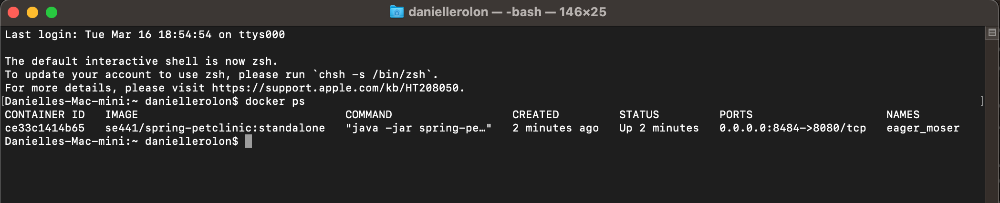

- Your browser accessing the main page of the website from your local container.

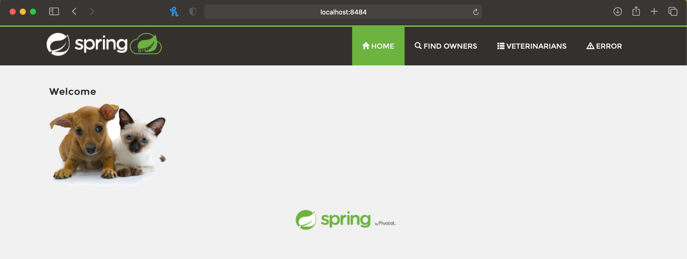

- The output from the docker-compose up command.

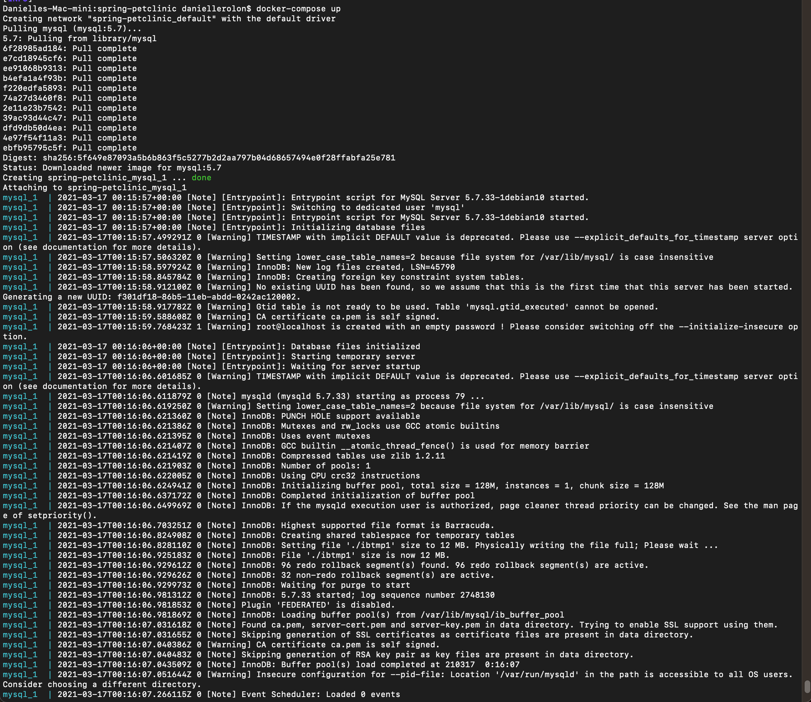
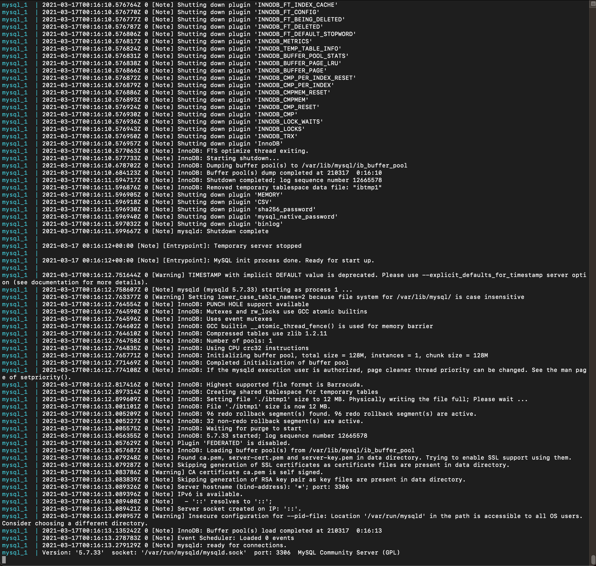

- Your browser accessing the “Veterinarians” page of the website from your local con-
tainer when you run the application from the host system.

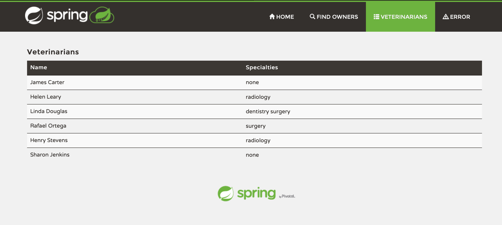

- A section of the stack trace generated when you attempt to run the application container that has been updated to use MySQL.

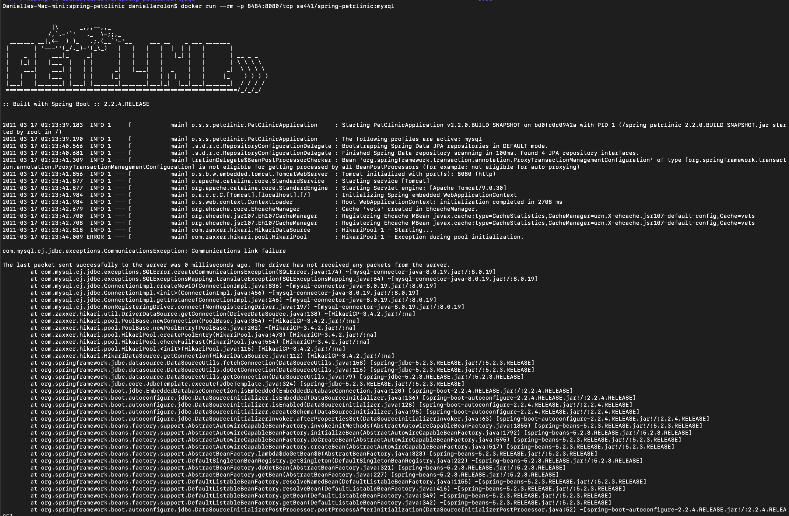

- Your updated docker-compose.yml file containing the application server, built from your local Dockerfile, and the existing MySQL configuration. Please provide a link to this file rather than a screen capture.

[docker-compose.yml](docker-compose.yml)

- Your updated application-mysql.properties file containing the URL change for the database server. Please provide a link to this file rather than a screen capture.

[application-mysql.properties](src/main/resources/application-mysql.properties)

- The output from the docker-compose up command.

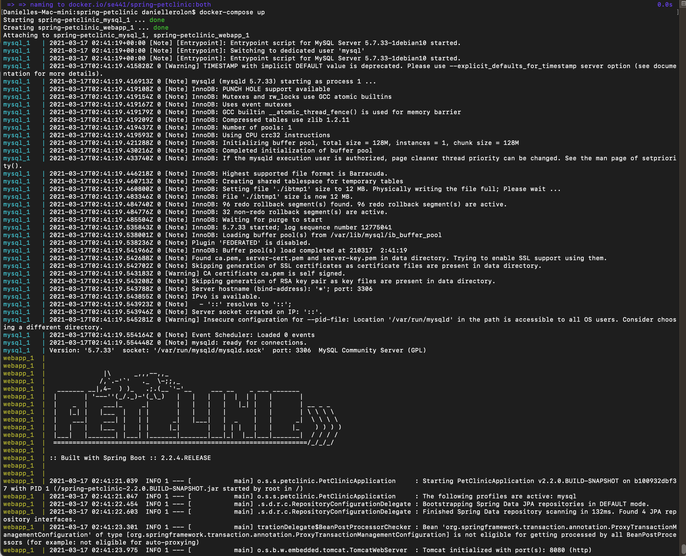
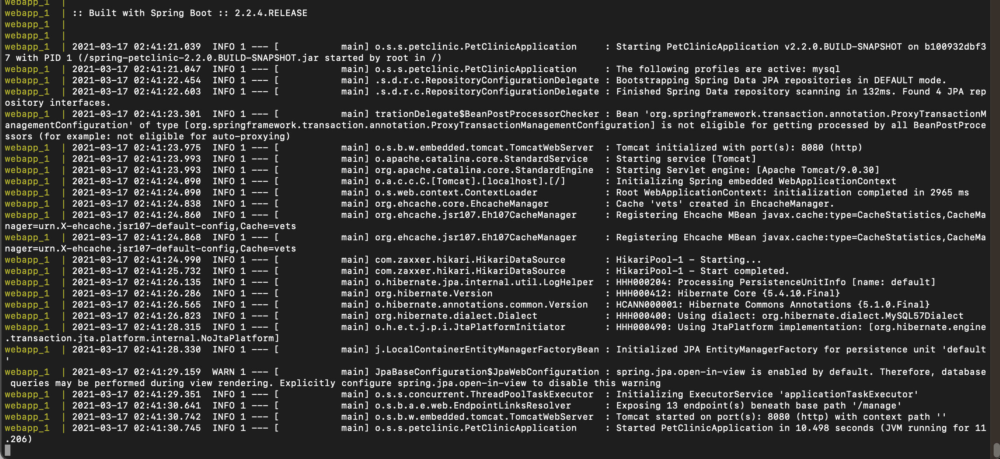

- Your browser accessing the “Veterinarians” page of the website from your local con- tainer.

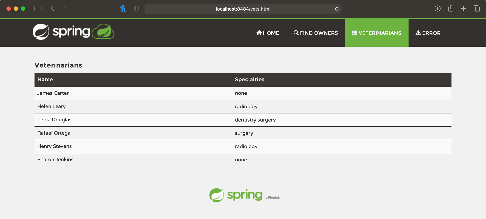

---

# Homework 5 Submission
- [5 pts] Your Github account showing that is has been forked from the depaulcdm/spring-
petclinic repository.

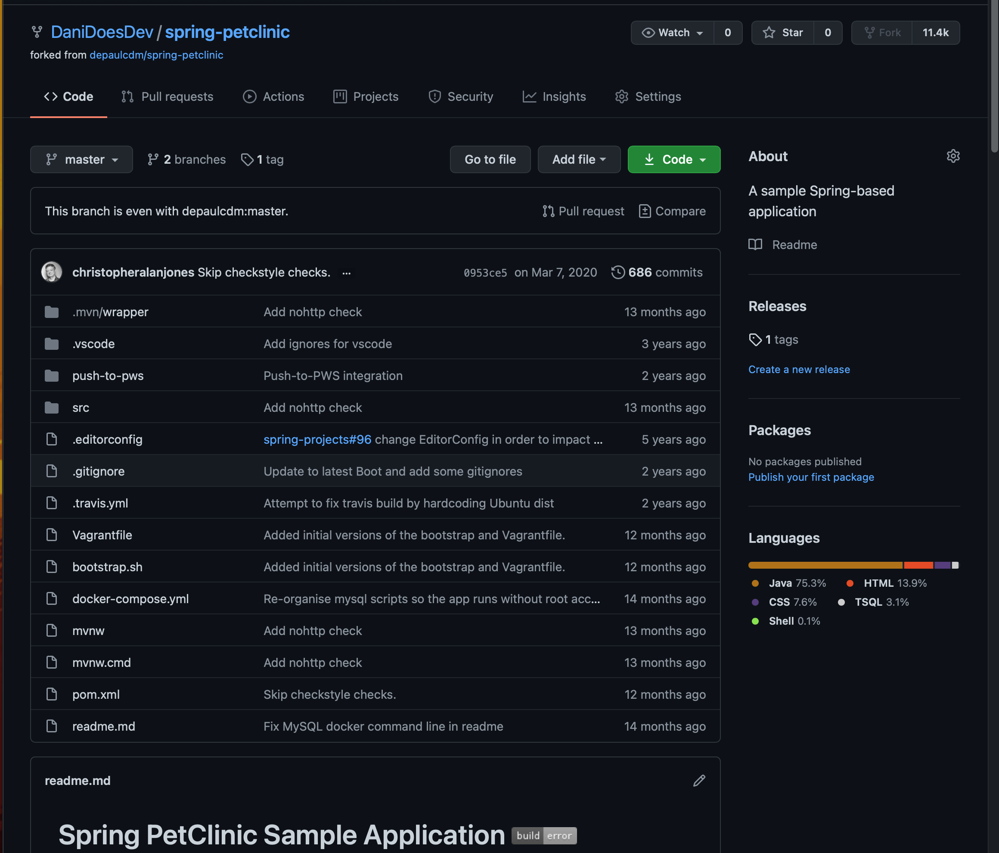

- [5 pts] Your Travis CI dashboard showing a successful first build.

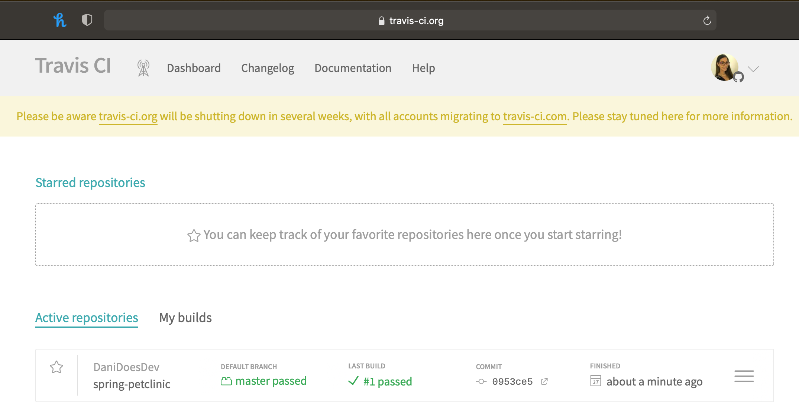

- [5 pts] The section of the POM file showing the coordinates after you’ve changed them.

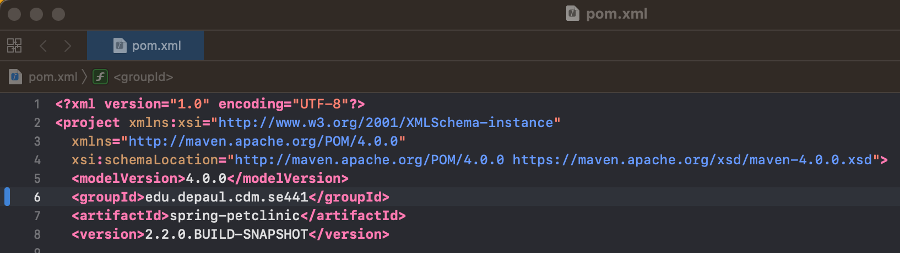

- [5 pts] Your Travis CI dashboard showing a successful build after your change of the group ID.

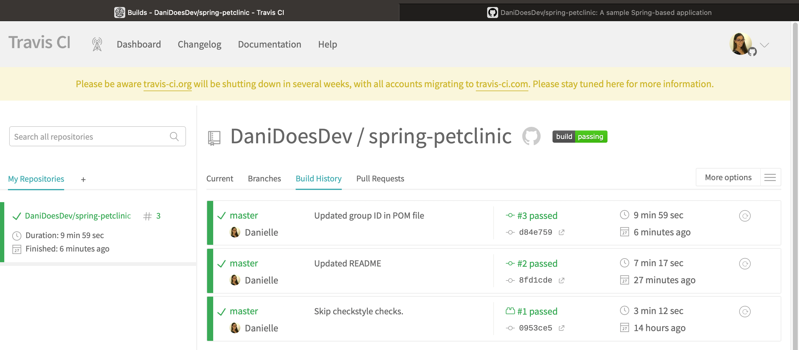

- [5 pts] The section of the POM file showing the coordinates after you’ve commented them out.

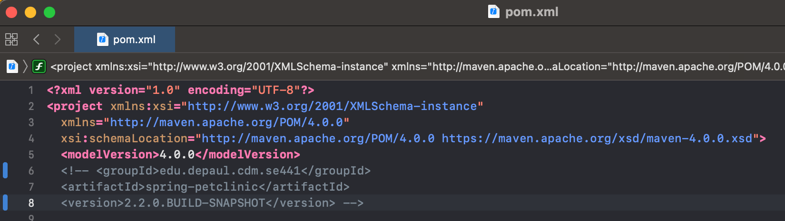

- [5 pts] Your Travis CI dashboard showing the unsuccessful build after the breaking change.

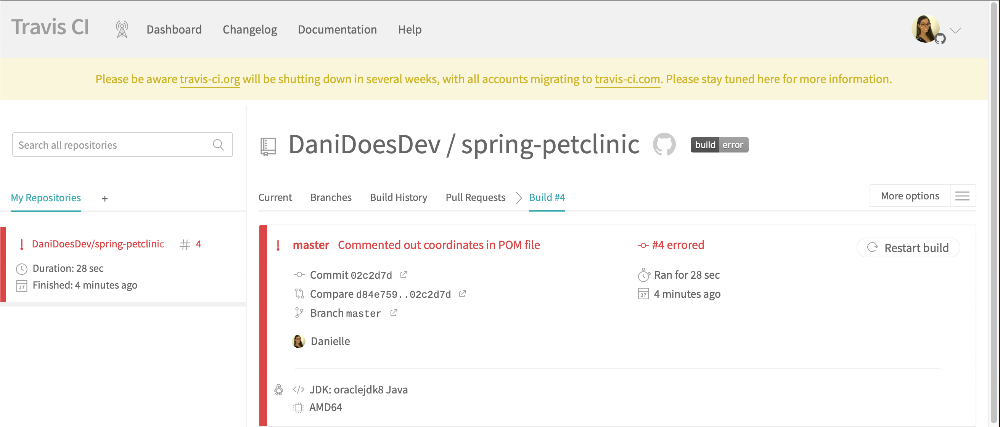

- [5 pts] Your Github repository with the readme.md file selected showing the build failed status after the Travis CI build fails.

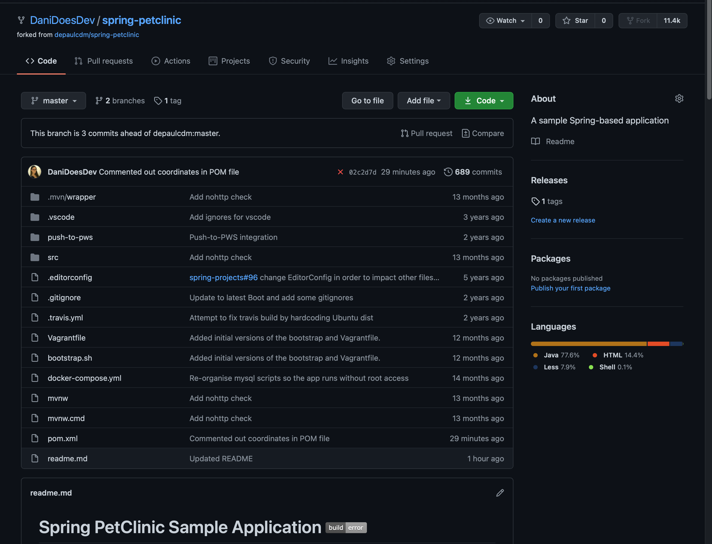

- [5 pts] The section of the POM file showing the coordinates after you’ve fixed them.

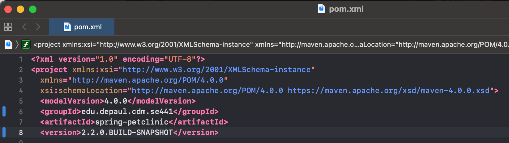

- [5 pts] Your Travis CI dashboard showing the successful build after the breaking change has been fixed.

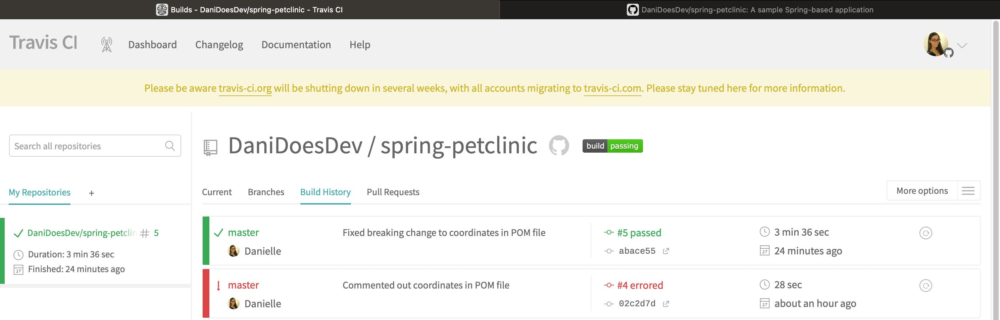

- [5 pts] Your Github repository with the readme.md file selected showing the build success status after the Travis CI build has recovered.

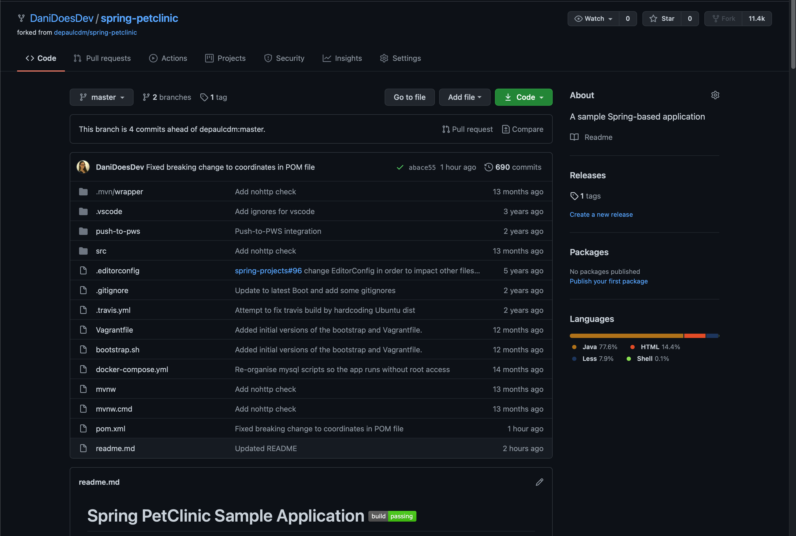
